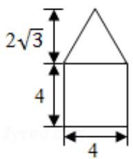
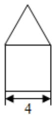
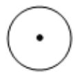

<!-- question-source:start -->
6.（5 分）如图是由圆柱与圆锥组合而成的几何体的三视图，则该几何体的表面积为（）

A. $20\pi$ B. $24\pi$ C. $28\pi$ D. $32\pi$

【考点】L!：由三视图求面积、体积.

【专题】15：综合题；35：转化思想；49：综合法；5F：空间位置关系与距离.
【
<!-- question-source:end -->

![[高中/真题/按年份分类/2016/2016年全国统一高考数学试卷_理科__新课标ⅱ__含解析版_/选择题/题目/answers/Q00027292A1.md]]
