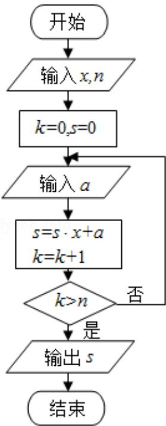

<!-- question-source:start -->
8. (5 分) 中国古代有计算多项式值的秦九韶算法, 如图是实现该算法的程序框
图. 执行该程序框图, 若输入的 $x = 2$ , $n = 2$ , 依次输入的 $a$ 为 2, 2, 5, 则输出的
s= ( )

A. 7 B. 12 C. 17 D. 34

【考点】EF：程序框图.

【专题】11：计算题；28：操作型；5K：算法和程序框图.

【
<!-- question-source:end -->

![[高中/真题/按年份分类/2016/2016年全国统一高考数学试卷_理科__新课标ⅱ__含解析版_/选择题/题目/answers/Q00027294A1.md]]
