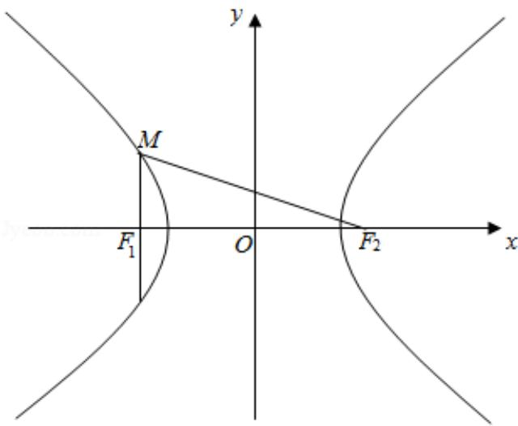

> [!faq]- 2016年全国统一高考数学试卷（理科）（新课标ⅱ）（含解析版）解析
>
> > [!success]- **【答案】** A
>
> > [!note]- **【分析】**
> > 由条件 $MF_{1} \perp MF_{2}$ ， $\sin \angle MF_{2}F_{1} = \frac{1}{3}$ ，列出关系式，从而可求离心率.
>
> > [!note]- **【解析】**
> > 解：由题意，M 为双曲线左支上的点，
> >
> > 则 $|\mathsf{MF}_1| = \frac{\mathsf{b}^2}{\mathsf{a}}$ ， $|\mathsf{MF}_2| = \sqrt{4c^2 + (\frac{\mathsf{b}^2}{\mathsf{a}})^2}$
> >
> > $\therefore \sin \angle M F_{2}F_{1} = \frac{1}{3}, \therefore \frac{\frac{b^{2}}{a}}{\sqrt{4c^{2} + \frac{b^{4}}{a^{2}}}} = \frac{1}{3},$
> >
> > 可得： $2b^{4}=a^{2}c^{2}$ ，即 $\sqrt{2}b^{2}=ac$ ，又 $c^{2}=a^{2}+b^{2}$ ，
> >
> > 可得 $\sqrt{2} e^{2} - e - \sqrt{2} = 0$
> >
> > $e>1$ ，解得 $e=\sqrt{2}$ .
> >
> > 故选：A.
> >
> > 
> >
> > 【点评】本题考查双曲线的定义及离心率的求解,关键是找出几何量之间的关系,
> >
> > 考查数形结合思想，属于中档题.
