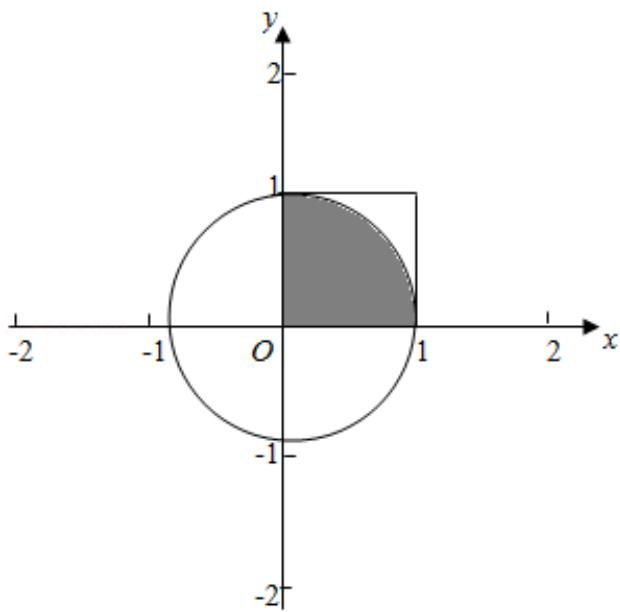

> [!faq]- 2016年全国统一高考数学试卷（理科）（新课标ⅱ）（含解析版）解析
>
> > [!success]- **【答案】** C
>
> > [!note]- **【分析】**
> > 以面积为测度，建立方程，即可求出圆周率 $\pi$ 的近似值.
>
> > [!note]- **【解析】**
> > 解: 由题意, 两数的平方和小于 1, 对应的区域的面积为 $\frac{1}{4}\pi \cdot 1^2$ , 从区间[0,
> >
> > 1】随机抽取 2n 个数 $x_{1}, x_{2}, \cdots, x_{n}, y_{1}, y_{2}, \cdots, y_{n}$ ，构成 n 个数对 $(x_{1}, y_{1})$ ， $(x_{2}, y_{2}), \cdots, x_{n}(y_{n})$ ，对应的区域的面积为 $1^{2}$ .
> >
> > $$
> > \therefore \frac {\mathrm{m}}{\mathrm{n}} = \frac {\frac {1}{4} \pi \cdot 1 ^ {2}}{1 ^ {2}}
> > $$
> >
> > $$
> > \therefore \pi = \frac {4 m}{n}.
> > $$
> >
> > 故选：C.
> >
> > 
> >
> > 【点评】古典概型和几何概型是我们学习的两大概型，古典概型要求能够列举出所有事件和发生事件的个数，而不能列举的就是几何概型，几何概型的概率的值是通过长度、面积和体积的比值得到。
