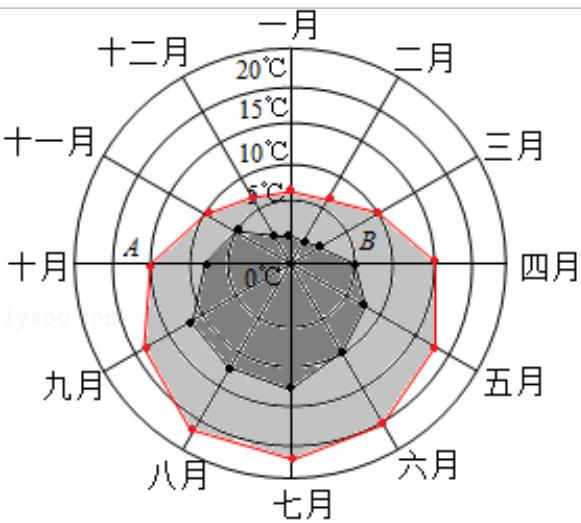
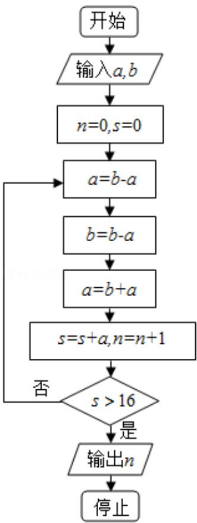
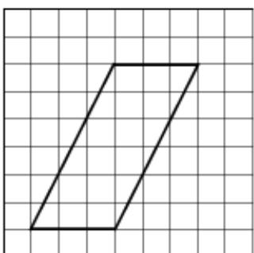
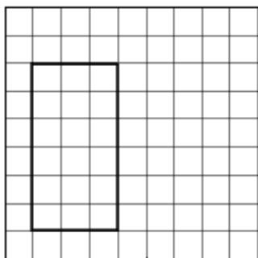
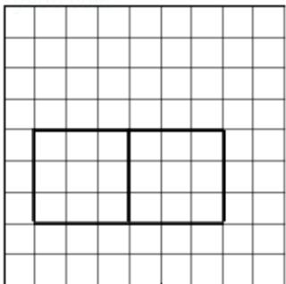

# 2016年全国统一高考数学试卷（理科）（新课标III）

项是符合题目要求的.

1. （5分）设集合 $S = \{x \mid (x - 2) \quad (x - 3) \geqslant 0\}$ ， $T = \{x \mid x > 0\}$ ，则 $S \cap T = (\quad)$ A. [2, 3] B. $(-\infty, 2] \cup [3, +\infty)$ C. $[3, +\infty)$ D. $(0, 2] \cup [3, +\infty)$

2. （5分）若 $z = 1 + 2\mathrm{i}$ ，则 $\frac{4\mathrm{i}}{\overline{\mathbf{z}^*}\overline{\mathbf{z}} - 1} = (\quad)$ A. 1 B. -1 C.i D.-i

3. （5分）已知向量 $\overrightarrow{BA} = (\frac{1}{2}, \frac{\sqrt{3}}{2})$ ， $\overrightarrow{BC} = (\frac{\sqrt{3}}{2}, \frac{1}{2})$ ，则 $\angle ABC = (\quad)$ A. $30^{\circ}$ B. $45^{\circ}$ C. $60^{\circ}$ D. $120^{\circ}$

4. (5 分) 某旅游城市为向游客介绍本地的气温情况, 绘制了一年中各月平均最高
气温和平均最低气温的雷达图, 图中 A 点表示十月的平均最高气温约为
15°C, B 点表示四月的平均最低气温约为 5°C, 下面叙述不正确的是（）

——平均最低气温 —— 平均最高气温
A. 各月的平均最低气温都在 $0^{\circ}$ C 以上
B. 七月的平均温差比一月的平均温差大
C. 三月和十一月的平均最高气温基本相同
D. 平均最高气温高于 $20^{\circ}$ C 的月份有 5 个

5. （5分）若 $\tan \alpha = \frac{3}{4}$ ，则 $\cos^2\alpha + 2\sin 2\alpha = (\quad)$ A. $\frac{64}{25}$ B. $\frac{48}{25}$ C. 1 D. $\frac{16}{25}$

6. （5分）已知 $a = \frac{4}{2^3}$ ， $b = \frac{2}{3^3}$ ， $c = \frac{1}{25^3}$ ，则（）
A. $b < a < c$ B. $a < b < c$ C. $b < c < a$ D. $c < a < b$

7. （5分）执行如图程序框图，如果输入的 $a = 4$ ， $b = 6$ ，那么输出的 $n =$ （

A. 3 B. 4 C. 5 D. 6

8. (5分) 在 $\triangle ABC$ 中, $B=\frac{\pi}{4}$ , BC边上的高等于 $\frac{1}{3}BC$ , 则 $\cos A$ 等于( )

A. $\frac{3\sqrt{10}}{10}$ B. $\frac{\sqrt{10}}{10}$ C. $-\frac{\sqrt{10}}{10}$ D. $-\frac{3\sqrt{10}}{10}$

9. (5 分) 如图, 网格纸上小正方形的边长为 1, 粗实线画出的是某多面体的三视
图，则该多面体的表面积为（）

A. $18 + 36\sqrt{5}$ B. $54 + 18\sqrt{5}$ C. 90 D. 81

10. （5分）在封闭的直三棱柱 $ABC-A_{1}B_{1}C_{1}$ 内有一个体积为 V 的球，若
AB⊥BC, AB=6, BC=8, AA₁=3, 则 V 的最大值是（）
A. 4π B. $\frac{9\pi}{2}$ C. 6π D. $\frac{32\pi}{3}$

11. (5 分) 已知 O 为坐标原点, F 是椭圆 C: $\frac{x^{2}}{a^{2}} + \frac{y^{2}}{b^{2}} = 1 (a > b > 0)$ 的左焦点, A, B 分别为 C 的左, 右顶点. P 为 C 上一点, 且 PF⊥x 轴, 过点 A 的直线 I 与线段 PF 交于点 M, 与 y 轴交于点 E. 若直线 BM 经过 OE 的中点, 则 C 的离心率为 ( )

A. $\frac{1}{3}$ B. $\frac{1}{2}$ C. $\frac{2}{3}$ D. $\frac{3}{4}$

12. (5 分) 定义 “规范 01 数列” $\{a_{n}\}$ 如下: $\{a_{n}\}$ 共有 $2m$ 项, 其中 $m$ 项为 $0, m$ 项为 1, 且对任意 $k \leq 2m$ , $a_{1}, a_{2}, \cdots, a_{k}$ 中 0 的个数不少于 1 的个数, 若 $m = 4$ , 则不同的 “规范 01 数列” 共有 ( )

A. 18 个 B. 16 个 C. 14 个 D. 12 个

##

![[高中/真题/按年份分类/2016/2016年全国统一高考数学试卷_理科__新课标ⅲ__含解析版_/填空题/填空题.md]]
![[高中/真题/按年份分类/2016/2016年全国统一高考数学试卷_理科__新课标ⅲ__含解析版_/解答题/解答题.md]]
![[高中/真题/按年份分类/2016/2016年全国统一高考数学试卷_理科__新课标ⅲ__含解析版_/选择题/选择题.md]]
