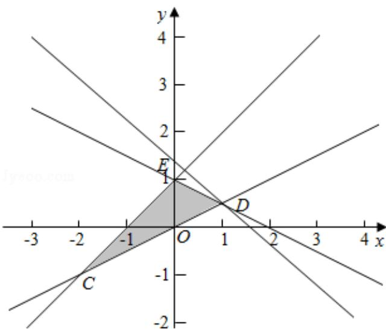

> [!faq]- 2016年全国统一高考数学试卷（理科）（新课标ⅲ）（含解析版）解析
>
> > [!success]- **【答案】** 为： $\frac{3}{2}$ 【点评】本题考查了简单线性规划；一般步骤是：①画出平面区域；②
>
> > [!note]- **【分析】**
> > 首先画出平面区域, 然后将目标函数变形为直线的斜截式, 求在 y 轴的截
>
> > [!note]- **【解析】**
> > 解：不等式组表示的平面区域如图阴影部分，当直线经过D点时，z最大，由 $\left\{\begin{aligned}x-2y=0\\ x+2y-2=0\end{aligned}\right.$ 得D $(1,\frac{1}{2})$ ，
> >
> > 所以 $z = x + y$ 的最大值为 $1 + \frac{1}{2} = \frac{3}{2}$ ;
> >
> > 
> >
> > 故
