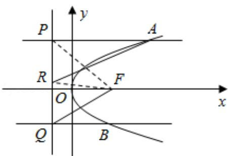

> [!faq]- 2016年全国统一高考数学试卷（理科）（新课标ⅲ）（含解析版）解析
>
> > [!success]- **【答案】** 详见解析
>
> > [!note]- **【分析】**
> > （Ⅰ）连接 RF，PF，利用等角的余角相等，证明 $\angle PRA = \angle PQF$ ，即可证明
>
> > [!note]- **【解析】**
> > 分析】（Ⅰ）连接 RF，PF，利用等角的余角相等，证明 $\angle PRA = \angle PQF$ ，即可证明
> >
> > AR||FQ;
> >
> > (II) 利用 $\triangle PQF$ 的面积是 $\triangle ABF$ 的面积的两倍, 求出 $N$ 的坐标, 利用点差法求 $AB$
> >
> > 中点的轨迹方程.
> >
> > 【
> > 解答】（Ⅰ）证明：连接 RF，PF，
> >
> > 由 AP=AF，BQ=BF 及 AP∥BQ，得 $\angle AFP+\angle BFQ=90^{\circ}$ ，
> >
> > $\therefore \angle PFQ = 90^{\circ},$
> >
> > ∵R 是 PQ 的中点，
> >
> > $\therefore RF=RP=RQ,$
> >
> > $\therefore\triangle PAR\cong\triangle FAR,$
> >
> > $\therefore \angle PAR = \angle FAR, \angle PRA = \angle FRA,$
> >
> > $\because \angle BQF + \angle BFQ = 180^{\circ} - \angle QBF = \angle PAF = 2\angle PAR,$
> >
> > $\therefore \angle FQB = \angle PAR,$
> >
> > $\therefore \angle PRA = \angle PQF,$
> >
> > ∴AR∥FQ.
> >
> > （Ⅱ）设 A $(x_{1}, y_{1})$ ，B $(x_{2}, y_{2})$ ，
> >
> > $F\left(\frac{1}{2},0\right)$ ，准线为 $x=-\frac{1}{2}$
> >
> > $$
> > S _ {\triangle P Q F} = \frac {1}{2} | P Q | = \frac {1}{2} \left| y _ {1} - y _ {2} \right|,
> > $$
> >
> > 设直线 AB 与 x 轴交点为 N，
> >
> > $$
> > \therefore S _ {\triangle A B F} = \frac {1}{2} | F N | \left| y _ {1} - y _ {2} \right|,
> > $$
> >
> > ∵△PQF 的面积是△ABF 的面积的两倍，
> >
> > $\therefore 2|FN|=1,\quad\therefore x_{N}=1,$ 即 N(1,0).
> >
> > 设 AB 中点为 M $(x, y)$ ，由 $\left\{\begin{aligned}y_{1}^{2}&=2x_{1}\\ y_{2}^{2}&=2x_{2}\end{aligned}\right.$ 得 $y_{1}^{2}-y_{2}^{2}=2(x_{1}-x_{2})$ ，
> >
> > 又 $\frac{y_1 - y_2}{x_1 - x_2} = \frac{y}{x - 1}$
> >
> > $\therefore\frac{y}{x-1}=\frac{1}{y}$ ，即 $y^{2}=x-1$ 。
> >
> > ∴AB 中点轨迹方程为 $y^{2}=x-1$ .
> >
> > 
> >
> > 【点评】本题考查抛物线的方程与性质，考查轨迹方程，考查学生的计算能力，属
> >
> > 于中档题.
