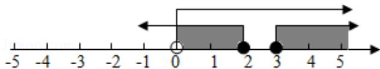

> [!faq]- 2016年全国统一高考数学试卷（理科）（新课标ⅲ）（含解析版）解析
>
> > [!success]- **【答案】** 详见解析
>
> > [!note]- **【分析】**
> > 求出 S 中不等式的解集确定出 S，找出 S 与 T 的交集即可.
>
> > [!note]- **【解析】**
> > 解：由 S 中不等式解得： $x \leq 2$ 或 $x \geq 3$ ，即 $S = (-\infty, 2] \cup [3, +\infty)$ ，
> >
> > $\because T = (0, +\infty)$
> >
> > $\therefore S \cap T = (0, 2] \cup [3, +\infty)$
> >
> > 故选：D.
> >
> > 
> >
> > 【点评】此题考查了交集及其运算，熟练掌握交集的定义是解本题的关键.
