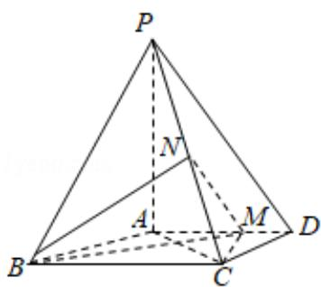

<!-- question-source:start -->
19．（12分）如图，四棱锥P-ABCD中，PA⊥底面

ABCD, AD∥BC, AB=AD=AC=3, PA=BC=4, M 为线段 AD 上一点, AM=2MD, N 为 PC

的中点.

(1) 证明: $MN \parallel$ 平面 $PAB$ ;

(2) 求直线 AN 与平面 PMN 所成角的正弦值.

<!-- question-source:end -->

![[高中/真题/按年份分类/2016/2016年全国统一高考数学试卷_理科__新课标ⅲ__含解析版_/解答题/题目/answers/Q00026868A1.md]]
