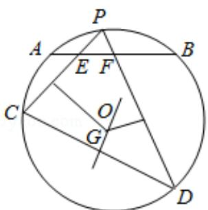

<!-- question-source:start -->
22. （10分）如图，⊙O中AB的中点为P，弦PC，PD分别交AB于E，F两点.

(1) 若 $\angle PFB = 2\angle PCD$ ，求 $\angle PCD$ 的大小；

(2) 若 EC 的垂直平分线与 FD 的垂直平分线交于点 G，证明：OG⊥CD.

## [选修 4-4：坐标系与参数方程]
<!-- question-source:end -->

![[高中/真题/按年份分类/2016/2016年全国统一高考数学试卷_理科__新课标ⅲ__含解析版_/解答题/题目/answers/Q00026871A1.md]]
