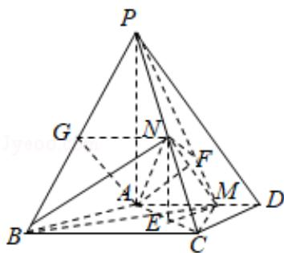

> [!faq]- 2016年全国统一高考数学试卷（理科）（新课标ⅲ）（含解析版）解析
>
> > [!success]- **【答案】** 详见解析
>
> > [!note]- **【分析】**
> > （1）法一、取 PB 中点 G，连接 AG，NG，由三角形的中位线定理可得
>
> > [!note]- **【解析】**
> > 分析】（1）法一、取 PB 中点 G，连接 AG，NG，由三角形的中位线定理可得
> >
> > NG $\| \mathrm{BC}$ ，且 $NG = \frac{1}{2} BC$ ，再由已知得 $AM\| BC$ ，且 $AM = \frac{1}{2} BC$ ，得到 $NG\| AM$ ，且
> >
> > NG=AM，说明四边形 AMNG 为平行四边形，可得 NM||AG，由线面平行的判定
> >
> > 得到 MN||平面 PAB;
> >
> > 法二、证明 MN||平面 PAB，转化为证明平面 NEM||平面 PAB，在△PAC 中，过 N 作
> >
> > NE⊥AC，垂足为 E，连接 ME，由已知 PA⊥底面 ABCD，可得 PA∥NE，通过求解直
> >
> > 角三角形得到 ME||AB，由面面平行的判定可得平面 NEM||平面 PAB，则结论得
> >
> > 证；
> >
> > (2) 连接 CM, 证得 CM⊥AD, 进一步得到平面 PNM⊥平面 PAD, 在平面 PAD 内, 过
> >
> > A作AF⊥PM，交PM于F，连接NF，则∠ANF为直线AN与平面PMN所成角.然
> >
> > 后求解直角三角形可得直线 AN 与平面 PMN 所成角的正弦值.
> >
> > 【
> > 解答】（1）证明：法一、如图，取PB中点G，连接AG，NG，
> >
> > ∵N 为 PC 的中点，
> >
> > ∴NG∥BC，且 $NG=\frac{1}{2}BC$ ，
> >
> > 又 $AM = \frac{2}{3} AD = 2$ ，BC=4，且AD∥BC，
> >
> > ∴AM∥BC，且 AM= $\frac{1}{2}$ BC，
> >
> > 则 NG∥AM，且 NG=AM，
> >
> > ∴四边形 AMNG 为平行四边形，则 NM∥AG，
> >
> > ∵AG⊂平面PAB，NM∉平面PAB，
> >
> > ∴MN∥平面 PAB;
> >
> > 法二、
> >
> > 在 $\triangle PAC$ 中，过N作NE⊥AC，垂足为E，连接ME，
> >
> > 在 $\triangle ABC$ 中，由已知 $AB=AC=3$ ， $BC=4$ ，得 $\cos\angle ACB=\frac{4^{2}+3^{2}-3^{2}}{2\times4\times3}=\frac{2}{3}$ ，
> >
> > ∵AD∥BC,
> >
> > $\therefore \cos \angle EAM = \frac{2}{3}$ ，则 $\sin \angle EAM = \frac{\sqrt{5}}{3}$ ，
> >
> > 在△EAM中，
> >
> > $$
> > \because A M = \frac {2}{3} A D = 2, A E = \frac {1}{2} A C = \frac {3}{2},
> > $$
> >
> > 由余弦定理得： $EM=\sqrt{AE^{2}+AM^{2}-2AE\cdot AM\cdot\cos\angle EAM}=\sqrt{\frac{9}{4}+4-2\times\frac{3}{2}\times2\times\frac{2}{3}}=\frac{3}{2}$
> >
> > $$
> > \therefore \cos \angle A E M = \frac {\left(\frac {3}{2}\right) ^ {2} + \left(\frac {3}{2}\right) ^ {2} - 4}{2 \times \frac {3}{2} \times \frac {3}{2}} = \frac {1}{9},
> > $$
> >
> > 而在 $\triangle ABC$ 中， $\cos\angle BAC=\frac{3^{2}+3^{2}-4^{2}}{2\times3\times3}=\frac{1}{9}$ ，
> >
> > $\therefore \cos \angle AEM = \cos \angle BAC$ ，即 $\angle AEM = \angle BAC$
> >
> > ∴AB∥EM，则 EM∥平面 PAB.
> >
> > 由 PA⊥底面 ABCD，得 PA⊥AC，又 NE⊥AC，
> >
> > ∴NE∥PA，则 NE∥平面 PAB.
> >
> > ∵NE∩EM=E,
> >
> > ∴平面 NEM∥平面 PAB，则 MN∥平面 PAB；
> >
> > (2) 解: 在 $\triangle$ AMC 中, 由 $AM = 2$ , $AC = 3$ , $\cos \angle MAC = \frac{2}{3}$ , 得 $CM^2 = AC^2 + AM^2 -$
> >
> > $$
> > 2 \mathrm{AC} \bullet \mathrm{AM} \bullet \cos \angle \mathrm{MAC} = 9 + 4 - 2 \times 3 \times 2 \times \frac {2}{3} = 5.
> > $$
> >
> > $\therefore AM^{2}+MC^{2}=AC^{2}$ ，则 $AM \perp MC$ ，
> >
> > ∵PA⊥底面 ABCD，PAC平面 PAD，
> >
> > ∴平面 ABCD⊥平面 PAD，且平面 ABCD∩平面 PAD=AD，
> >
> > ∴CM⊥平面 PAD，则平面 PNM⊥平面 PAD.
> >
> > 在平面 PAD 内，过 A 作 AF⊥PM，交 PM 于 F，连接 NF，则 ∠ANF 为直线 AN 与平面
> >
> > PMN 所成角.
> >
> > 在 Rt△PAC 中，由 N 是 PC 的中点，得 AN= $\frac{1}{2}$ PC= $\frac{1}{2}\sqrt{PA^{2}+PC^{2}}=\frac{5}{2}$
> >
> > 在 Rt△PAM 中，由 PA●AM=PM●AF，得 AF= $\frac{PA\cdot AM}{PM}=\frac{4\times2}{\sqrt{4^{2}+2^{2}}}=\frac{4\sqrt{5}}{5}$ ，
> >
> > $$
> > \therefore \sin \angle A N F = \frac {A F}{A N} = \frac {\frac {4 \sqrt {5}}{5}}{\frac {5}{2}} = \frac {8 \sqrt {5}}{2 5}.
> > $$
> >
> > ∴直线 AN 与平面 PMN 所成角的正弦值为 $\frac{8\sqrt{5}}{25}$ .
> >
> > 
> >
> > 【点评】本题考查直线与平面平行的判定,考查直线与平面所成角的求法,考查数
> >
> > 学转化思想方法，考查了空间想象能力和计算能力，是中档题.
