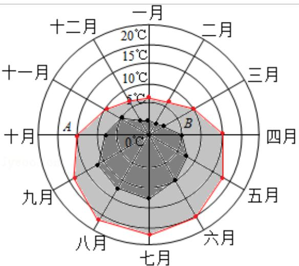

<!-- question-source:start -->
4.（5分）某旅游城市为向游客介绍本地的气温情况，绘制了一年中各月平均最高

气温和平均最低气温的雷达图，图中A点表示十月的平均最高气温约为

$15^{\circ} \mathrm{C}$ , B点表示四月的平均最低气温约为 $5^{\circ} \mathrm{C}$ , 下面叙述不正确的是 ( )

——平均最低气温 —— 平均最高气温
A. 各月的平均最低气温都在 $0^{\circ}$ C 以上
B. 七月的平均温差比一月的平均温差大
C. 三月和十一月的平均最高气温基本相同
D. 平均最高气温高于 $20^{\circ}$ C 的月份有 5 个

【考点】F4：进行简单的合情推理.

【专题】31：数形结合；4A：数学模型法；5M：推理和证明.

【
<!-- question-source:end -->

![[高中/真题/按年份分类/2016/2016年全国统一高考数学试卷_理科__新课标ⅲ__含解析版_/选择题/题目/answers/Q00026877A1.md]]
