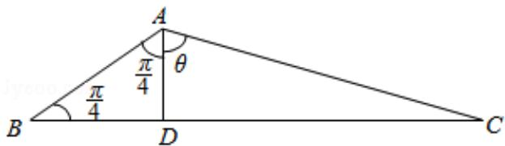

> [!faq]- 2016年全国统一高考数学试卷（理科）（新课标ⅲ）（含解析版）解析
>
> > [!success]- **【答案】** C
>
> > [!note]- **【分析】**
> > 作出图形，令 $\angle DAC = \theta$ ，依题意，可求得 $\cos \theta = \frac{AD}{AC} = \frac{\frac{a}{3}}{\sqrt{\left(\frac{1}{3}a\right)^2\left(\frac{2a}{3}\right)^2}} = \frac{\sqrt{5}}{5}$ $，\sin \theta = \frac{2\sqrt{5}}{5}$ ，利用两角和的余弦即可求得
>
> > [!note]- **【解析】**
> > 解：设△ABC中角A、B、C、对应的边分别为a、b、c，AD⊥BC于D，令
> >
> > $$
> > \angle D A C = \theta ,
> > $$
> >
> > 
> >
> > ∵在△ABC中， $B=\frac{\pi}{4}$ ，BC边上的高AD=h= $\frac{1}{3}$ BC= $\frac{1}{3}$ a，
> >
> > $\therefore BD=AD=\frac{1}{3}a,\quad CD=\frac{2}{3}a,$
> >
> > 在 Rt△ADC 中， $\cos\theta=\frac{AD}{AC}=\frac{\frac{a}{3}}{\sqrt{\left(\frac{1}{3}a\right)^{2}+\left(\frac{2a}{3}\right)^{2}}}=\frac{\sqrt{5}}{5}$ ，故 $\sin\theta=\frac{2\sqrt{5}}{5}$ ，
> >
> > $$
> > \therefore \cos A = \cos \left(\frac {\pi}{4} + \theta\right) = \cos \frac {\pi}{4} \cos \theta - \sin \frac {\pi}{4} \sin \theta = \frac {\sqrt {2}}{2} \times \frac {\sqrt {5}}{5} - \frac {\sqrt {2}}{2} \times \frac {2 \sqrt {5}}{5} = - \frac {\sqrt {1 0}}{1 0}.
> > $$
> >
> > 故选：C.
> >
> > 【点评】本题考查解三角形中，作出图形，令 $\angle DAC = \theta$ ，利用两角和的余弦求cosA
> >
> > 是关键，也是亮点，属于中档题.
