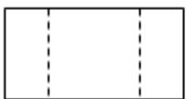
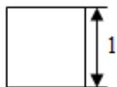
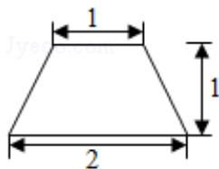

<!-- question-source:start -->
11. （2016·北京）某四棱柱的三视图如图所示，则该四棱柱的体积为 $\frac{3}{2}$ .

  
侧(左)视图

正(主)视图  
  
俯视图

【考点】由三视图求面积、体积.

【专题】计算题；空间位置关系与距离；立体几何.
<!-- question-source:end -->

![[高中/真题/按年份分类/2016/2016年北京高考文科数学试题及答案/二_填空题_共6小题_/题目/answers/Q00020746A1.md]]
