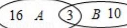

> [!faq]- 2016年北京高考文科数学试题及答案解析
>
> > [!success]- **【答案】** ；②求出前两天所受商品的种数，由特殊情况得到三天售出的商品最少种数. 【
>
> > [!note]- **【分析】**
> > ①由题意画出图形得
>
> > [!note]- **【解析】**
> > 解：①设第一天售出商品的种类集为 A，第二天售出商品的种类集为 B，第三天售出商品的种类集为 C，
> >
> > 如图，
> >
> > 
> >
> > 则第一天售出但第二天未售出的商品有 16 种；
> >
> > ②由①知，前两天售出的商品种类为 $19+13-3=29$ 种，
> >
> > 当第三天售出的18种商品都是第一天或第二天售出的商品时，这三天售出的商品种类最少为29种.
> >
> > 故
