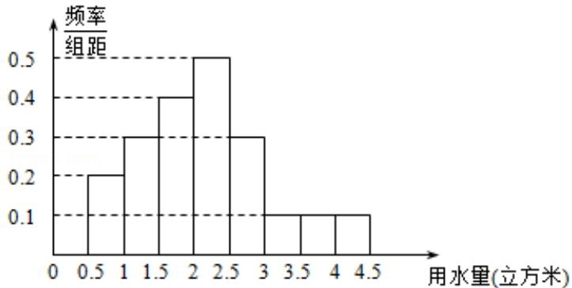

<!-- question-source:start -->
17. (2016·北京) 某市居民用水拟实行阶梯水价, 每人月用水量中不超过 w 立方米的部分按 4 元/立方米收费, 超出 w 立方米的部分按 10 元/立方米收费, 从该市随机调查了 10000 位居民,获得了他们某月的用水量数据, 整理得到如图频率分布直方图:

(1) 如果 w 为整数, 那么根据此次调查, 为使 80% 以上居民在该月的用水价格为 4 元/立方米, w 至少定为多少?

(2) 假设同组中的每个数据用该组区间的右端点值代替，当 $w = 3$ 时，估计该市居民该月的人均水费.

【考点】频率分布直方图；随机抽样和样本估计总体的实际应用.

【专题】计算题；转化思想；综合法；概率与统计.

【
<!-- question-source:end -->

![[高中/真题/按年份分类/2016/2016年北京高考文科数学试题及答案/解答题/题目/answers/Q00021702A1.md]]
