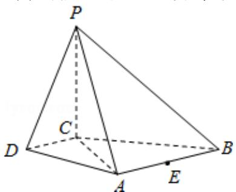

<!-- question-source:start -->
18. （2016·北京）如图，在四棱锥 P-ABCD 中，PC⊥平面 ABCD，AB∥DC，DC⊥AC.

(1) 求证: DC⊥平面 PAC;

(2) 求证: 平面 $\mathrm{PAB} \perp$ 平面 PAC;

(3) 设点 E 为 AB 的中点，在棱 PB 上是否存在点 F，使得 PA∥平面 CEF？说明理由.

【考点】空间中直线与平面之间的位置关系；平面与平面之间的位置关系.

【专题】综合题；转化思想；综合法；立体几何.

【
<!-- question-source:end -->

![[高中/真题/按年份分类/2016/2016年北京高考文科数学试题及答案/解答题/题目/answers/Q00021703A1.md]]
