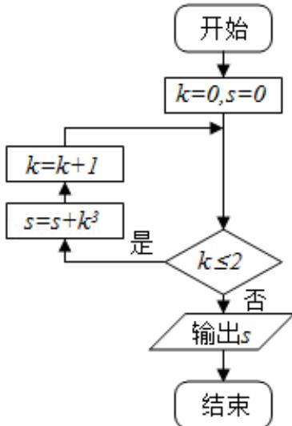

<!-- question-source:start -->
3. （2016·北京）执行如图所示的程序框图，输出 s 的值为（）

A.8B.9C.27 D.36

【考点】程序框图.

【专题】计算题；操作型；算法和程序框图.
<!-- question-source:end -->

![[高中/真题/按年份分类/2016/2016年北京高考文科数学试题及答案/选择题/题目/answers/Q00020738A1.md]]
