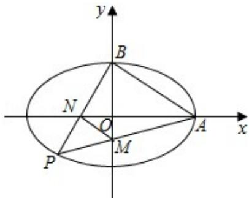

> [!faq]- 2016年北京高考文科数学试题及答案解析
>
> > [!success]- **【答案】** 详见解析
>
> > [!note]- **【分析】**
> > 本题未单列分析。
>
> > [!note]- **【解析】**
> > （1）解：∵椭圆C: $\frac{x^{2}}{a^{2}}+\frac{y^{2}}{b^{2}}=1$ 过点A（2，0），B（0，1）两点，
> >
> > $\therefore a = 2, b = 1$ ，则 $c = \sqrt{a^2 - b^2} = \sqrt{4 - 1} = \sqrt{3}$ ，
> >
> > ∴椭圆 C 的方程为 $\frac{x^{2}}{4} + y^{2} = 1$ ，离心率为 $e = \frac{\sqrt{3}}{2}$ ;
> > (2) 证明：如图，
> >
> > 设 $\mathrm{P(x_0,y_0)}$ ，则 $\mathrm{k}_{\mathrm{PA}} = \frac{\mathrm{y}_0}{\mathrm{x}_0 - 2}$ ，PA所在直线方程为 $\mathrm{y} = \frac{\mathrm{y}_0}{\mathrm{x}_0 - 2} (\mathrm{x} - 2)$
> >
> > 取 $x = 0$ ，得 $\mathbf{y}_{\mathbb{M}} = -\frac{2\mathbf{y}_0}{\mathbf{x}_0 - 2};$
> >
> > $k_{PB}=\frac{y_{0}-1}{x_{0}}$ ，PB所在直线方程为 $y=\frac{y_{0}-1}{x_{0}}x+1$
> >
> > 取 $y = 0$ ，得 $\mathbf{x}_{\mathbb{N}} = \frac{\mathbf{x}_0}{1 - \mathbf{y}_0}$
> >
> > $$
> > \therefore | \mathrm{AN} | = 2 - \mathrm{x} _ {\mathrm{N}} = 2 - \frac {\mathrm{x} _ {0}}{1 - \mathrm{y} _ {0}} = \frac {2 - 2 \mathrm{y} _ {0} - \mathrm{x} _ {0}}{1 - \mathrm{y} _ {0}},
> > $$
> >
> > $$
> > | \mathrm{BM} | = 1 - x _ {\mathrm{M}} = 1 + \frac {2 y _ {0}}{x _ {0} - 2} = \frac {x _ {0} + 2 y _ {0} - 2}{x _ {0} - 2}.
> > $$
> >
> > $$
> > \therefore S _ {A B N M} = \frac {1}{2} \cdot | A N | \cdot | B M | = \frac {1}{2} \cdot \frac {2 - 2 y _ {0} - x _ {0}}{1 - y _ {0}} \cdot \frac {x _ {0} + 2 y _ {0} - 2}{x _ {0} - 2}
> > $$
> >
> > $$
> > = - \frac {1}{2} \frac {\left(x _ {0} + 2 y _ {0} - 2\right) ^ {2}}{\left(1 - y _ {0}\right) \left(x _ {0} - 2\right)} = \frac {1}{2} \frac {\left(x _ {0} + 2 y _ {0}\right) ^ {2} - 4 \left(x _ {0} + 2 y _ {0}\right) + 4}{x _ {0} y _ {0} + 2 - x _ {0} - 2 y _ {0}} = \frac {1}{2}
> > $$
> >
> > $$
> > \frac {\mathbf {x} _ {0} ^ {2} + 4 \mathbf {x} _ {0} \mathbf {y} _ {0} + 4 \mathbf {y} _ {0} ^ {2} - 4 \mathbf {x} _ {0} - 8 \mathbf {y} _ {0} + 4}{\mathbf {x} _ {0} \mathbf {y} _ {0} + 2 - \mathbf {x} _ {0} - 2 \mathbf {y} _ {0}}
> > $$
> >
> > $$
> > = \frac {1}{2} \frac {4 \left(x _ {0} y _ {0} + 2 - x _ {0} - 2 y _ {0}\right)}{x _ {0} y _ {0} + 2 - x _ {0} - 2 y _ {0}} = \frac {1}{2} \times 4 = 2.
> > $$
> >
> > ∴四边形ABNM的面积为定值2.
> >
> > 
> >
> > 【点评】本题考查椭圆的标准方程，考查了椭圆的简单性质，考查计算能力与推理论证能力，是中档题.
