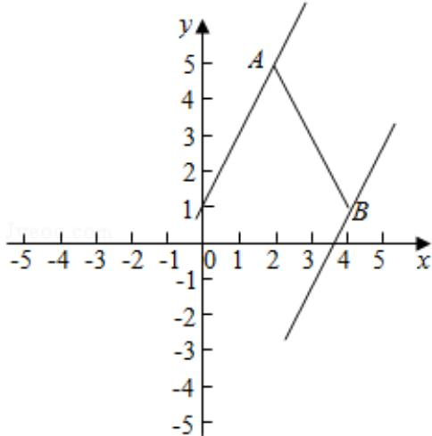

> [!faq]- 2016年北京高考文科数学试题及答案解析
>
> > [!success]- **【答案】** C
>
> > [!note]- **【分析】**
> > 平行直线 z=2x-y，判断取得最值的位置，求解即可.
>
> > [!note]- **【解析】**
> > 分析】平行直线 z=2x-y，判断取得最值的位置，求解即可.
> >
> > 【
> > 解答】解：如图 A（2，5），B（4，1）。若点 P（x，y）在线段 AB 上，令 z=2x-y，则平行 y=2x-z 当直线经过 B 时截距最小，Z 取得最大值，可得 2x-y 的最大值为： $2 \times 4 - 1 = 7$ 。
> >
> > 故选：C.
> >
> > 
> >
> > 【点评】本题考查线性规划的简单应用，判断目标函数经过的点，是解题的关键.
