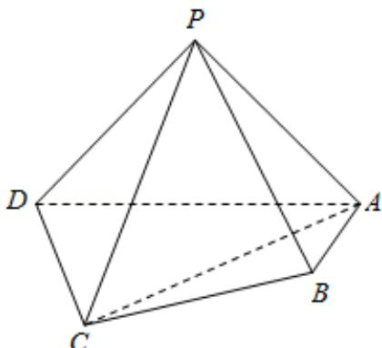

<!-- question-source:start -->
17. （14分）（2016·北京）如图，在四棱锥P-ABCD中，平面PAD⊥平面

ABCD, PA⊥PD, PA=PD, AB⊥AD, AB=1, AD=2, AC=CD= $\sqrt{5}$ .

（Ⅰ）求证：PD⊥平面PAB；

（Ⅱ）求直线 PB 与平面 PCD 所成角的正弦值；

（III）在棱 PA 上是否存在点 M，使得 BM∥平面 PCD？若存在，求 $\frac{AM}{AP}$ 的值，若不存在，说明理由.

<!-- question-source:end -->

![[高中/真题/按年份分类/2016/2016年北京高考理科数学试题及答案/填空题/题目/answers/Q00023173A1.md]]
