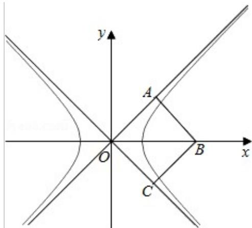

> [!faq]- 2016年北京高考理科数学试题及答案解析
>
> > [!success]- **【答案】** 为：2  【点评】本题主要考查双曲线的性质的应用，根据双曲线渐近线垂直关系得到双曲线是等轴双曲线是解决本题的关键.
>
> > [!note]- **【分析】**
> > 根据双曲线渐近线在正方形的两个边, 得到双曲线的渐近线互相垂直, 即双曲线是等轴双曲线, 结合等轴双曲线的性质进行求解即可.
>
> > [!note]- **【解析】**
> > 分析】根据双曲线渐近线在正方形的两个边, 得到双曲线的渐近线互相垂直, 即双曲线是等轴双曲线, 结合等轴双曲线的性质进行求解即可.
> >
> > 【
> > 解答】解：∵双曲线的渐近线为正方形OABC的边OA，OC所在的直线，∴渐近线互相垂直，则双曲线为等轴双曲线，即渐近线方程为 $y=\pm x$ ，
> >
> > ∵正方形 OABC 的边长为 2，
> >
> > $\therefore OB=2\sqrt{2}$ ，即 $c=2\sqrt{2}$ ，
> >
> > 则 $a^{2}+b^{2}=c^{2}=8$ ，
> >
> > 即 $2a^{2}=8$ ，
> >
> > 则 $a^2 = 4$ ， $a = 2$
> >
> > 故
> > 答案为：2
> >
> > 
> >
> > 【点评】本题主要考查双曲线的性质的应用，根据双曲线渐近线垂直关系得到双曲线是等轴双曲线是解决本题的关键.
