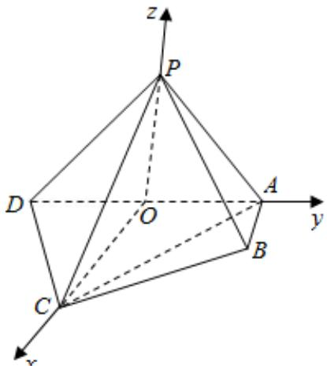

> [!faq]- 2016年北京高考理科数学试题及答案解析
>
> > [!success]- **【答案】** （14分）（2016·北京）如图，在四棱锥 P-ABCD 中，平面 PAD⊥平面 ABCD，PA⊥PD，PA=PD，AB⊥AD，AB=1，AD=2，AC=CD $\sqrt{5}$
>
> > [!note]- **【分析】**
> > （Ⅰ）由已知结合面面垂直的性质可得 AB⊥平面 PAD，进一步得到 AB⊥PD，再由 PD⊥PA，由线面垂直的判定得到 PD⊥平面 PAB；
>
> > [!note]- **【解析】**
> > （Ⅰ）证明：∵平面 PAD⊥平面 ABCD，且平面 PAD∩平面 ABCD=AD，
> >
> > 且 AB⊥AD，ABC平面 ABCD，
> >
> > ∴AB⊥平面 PAD,
> >
> > ∵PD⊂平面 PAD,
> >
> > 又 PD⊥PA，且 PA∩AB=A，
> >
> > ∴PD⊥平面PAB;
> >
> > （Ⅱ）解：取 AD 中点为 O，连接 CO，PO，
> > ∵CD=AC= $\sqrt{5}$ ,
> > ∴CO⊥AD,
> > 又∵PA=PD,
> > ∴PO⊥AD.
> >
> > 以 O 为坐标原点，建立空间直角坐标系如图：
> > 则 P（0，0，1），B（1，1，0），D（0，-1，0），C（2，0，0），则 $\overrightarrow{\mathrm{PB}} = (1, 1, -1)$ ， $\overrightarrow{\mathrm{PD}} = (0, -1, -1)$ ， $\overrightarrow{\mathrm{PC}} = (2, 0, -1)$ ， $\overrightarrow{\mathrm{CD}} = (-2, -1, 0)$ ，  
> > 设 $\vec{n} = (x_0, y_0, 1)$ 为平面PCD的法向量，  
> > 则由 $\left\{ \begin{array}{l} \vec{n} \cdot \overrightarrow{\mathrm{PD}} = 0 \\ \vec{n} \cdot \overrightarrow{\mathrm{PC}} = 0 \end{array} \right.$ ，得 $\left\{ \begin{array}{l} -y_0 - 1 = 0 \\ 2x_0 - 1 = 0 \end{array} \right.$ ，则 $\vec{n} = (\frac{1}{2}, -1, 1)$ 。  
> > 设PB与平面PCD的夹角为θ，则sinθ = |cos < n， $\overrightarrow{\mathrm{PB}} >| = |\frac{\vec{n} \cdot \overrightarrow{\mathrm{PB}}}{|\vec{n}| |\overrightarrow{\mathrm{PB}}|}| = |\frac{\frac{1}{2} - 1 - 1}{\sqrt{\frac{1}{4} + 1 + 1} \times \sqrt{3}}| = \frac{\sqrt{3}}{3}$ ;
> >
> > （Ⅲ）解：假设存在 M 点使得 BM∥平面 PCD，设 $\frac{AM}{AP} = \lambda$ ，M $(0, y_{1}, z_{1})$ ，
> > 由（Ⅱ）知，A $(0, 1, 0)$ ，P $(0, 0, 1)$ ， $\overrightarrow{AP} = (0, -1, 1)$ ，B $(1, 1, 0)$ ， $\overrightarrow{AM}=(0,\quad y_{1}-1,\quad z_{1})$ 则有 $\overrightarrow{AM}=\lambda\overrightarrow{AP}$ ，可得 M $(0,1-\lambda,\lambda)$ ， $\therefore\overrightarrow{BM}=(-1,-\lambda,\lambda)$ $\because BM\|$ 平面 PCD， $\vec{n}=(\frac{1}{2},-1,1)$ 为平面 PCD 的法向量， $\therefore\overrightarrow{BM}\cdot\overrightarrow{n}=0$ ，即 $-\frac{1}{2}+\lambda+\lambda=0$ ，解得 $\lambda=\frac{1}{4}$ .
> > 综上，存在点 M，即当 $\frac{AM}{AP}=\frac{1}{4}$ 时，M 点即为所求.
> >
> > 
