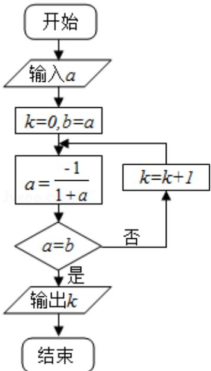

<!-- question-source:start -->
3. (5 分) (2016·北京) 执行如图所示的程序框图, 若输入的 a 值为 1 , 则输出的 k 值为 ( )

A. 1 B. 2 C. 3 D. 4
<!-- question-source:end -->

![[高中/真题/按年份分类/2016/2016年北京高考理科数学试题及答案/选择题/题目/answers/Q00023159A1.md]]
