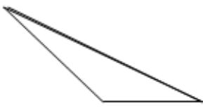
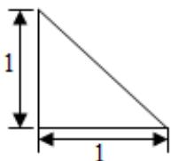
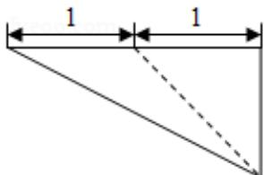

<!-- question-source:start -->
6. （5分）（2016·北京）某三棱锥的三视图如图所示，则该三棱锥的体积为（）

  
正(主)视图

  
侧(左)视图  
俯视图

A. $\frac{1}{6}$ B. $\frac{1}{3}\mathrm{C}.\frac{1}{2}\mathrm{D}.1$
<!-- question-source:end -->

![[高中/真题/按年份分类/2016/2016年北京高考理科数学试题及答案/选择题/题目/answers/Q00023162A1.md]]
