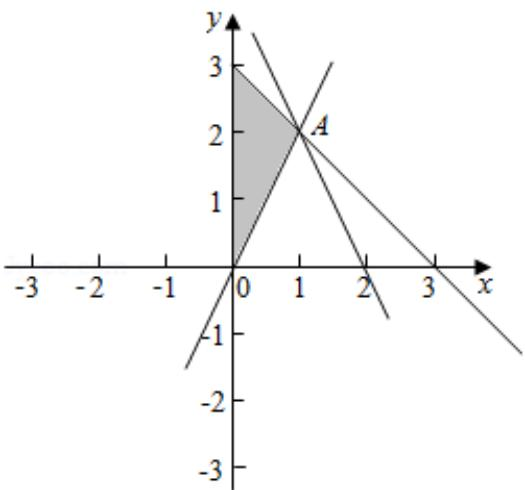

> [!faq]- 2016年北京高考理科数学试题及答案解析
>
> > [!success]- **【答案】** 详见解析
>
> > [!note]- **【分析】**
> > 作出不等式组对应的平面区域，目标函数的几何意义是直线的纵截距，利用数形结合即可求 z 的取值范围.
>
> > [!note]- **【解析】**
> > 解：作出不等式组 $\left\{\begin{aligned}&2x-y\leqslant0\\&x+y\leqslant3\\&x\geqslant0\end{aligned}\right.$ 对应的平面区域如图：（阴影部分）.
> >
> > 设 $z=2x+y$ 得 $y=-2x+z$ ,
> >
> > 平移直线 $y = -2x + z$ ,
> >
> > 由图象可知当直线 $y = -2x + z$ 经过点 A 时，直线 $y = -2x + z$ 的截距最大，此时 z 最大.
> >
> > 由 $\left\{\begin{aligned}&2x-y=0\\&x+y=3\end{aligned}\right.$ ，解得 $\left\{\begin{aligned}&x=1\\&y=2\end{aligned}\right.$ ，即A（1，2），
> >
> > 代入目标函数 $z=2x+y$ 得 $z=1\times2+2=4$ .
> >
> > 即目标函数 $z=2x+y$ 的最大值为 4.
> >
> > 故选：C.
> >
> > 
> >
> > 【点评】本题主要考查线性规划的应用, 利用目标函数的几何意义, 结合数形结合的数学思想是解决此类问题的基本方法.
