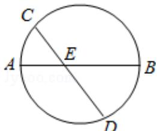

<!-- question-source:start -->
13. （5分）（2016·天津）如图，AB是圆的直径，弦CD与AB相交于点E，BE=2AE=2，BD=ED，则线段CE的长为\_\_\_\_。

<!-- question-source:end -->

![[高中/真题/按年份分类/2016/2016年天津高考文科数学试题及答案_Word版_/填空题/题目/answers/Q00023733A1.md]]
