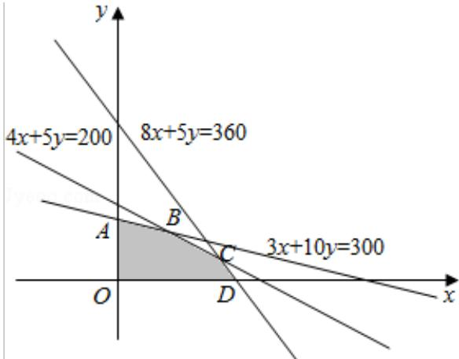

> [!faq]- 2016年天津高考文科数学试题及答案(Word版)解析
>
> > [!success]- **【答案】** （13分）(2016·天津)某化工厂生产甲、乙两种混合肥料，需要A，B，C三种主要原料，生产1扯皮甲种肥料和生产1车皮乙种肥料所需三种原料的吨数如表所示：
>
> > [!note]- **【分析】**
> > （1）根据原料的吨数列出不等式组，作出平面区域；
> > (2) 令利润 $z = 2x + 3y$ ，则 $y = -\frac{2}{3} x + \frac{z}{3}$ ，结合可行域找出最优解的位置，列方程组解出最优解。
>
> > [!note]- **【解析】**
> > 解：（1）x，y 满足的条件关系式为： $\left\{\begin{aligned}&4x+5y\leqslant200\\ &8x+5y\leqslant360\\ &3x+10y\leqslant300\\ &x\geqslant0\\ &y\geqslant0\end{aligned}\right.$
> >
> > 作出平面区域如图所示：
> >
> > 
> > (2) 设利润为 z 万元，则 $z=2x+3y$ .
> >
> > $$
> > \therefore \mathrm{y} = - \frac {2}{3} \mathrm{x} + \frac {\mathrm{z}}{3}
> > $$
> >
> > ∴当直线 $y=-\frac{2}{3}x+\frac{z}{3}$ 经过点 B 时，截距 $\frac{z}{3}$ 最大，即 z 最大.
> >
> > 解方程组 $\left\{ \begin{array}{l} 4x + 5y = 200 \\ 3x + 10y = 300 \end{array} \right.$ 得B（20，24）
> >
> > ∴z 的最大值为 $2 \times 20 + 3 \times 24 = 112$ .
> >
> > 答：当生产甲种肥料20吨，乙种肥料24吨时，利润最大，最大利润为112万元.
