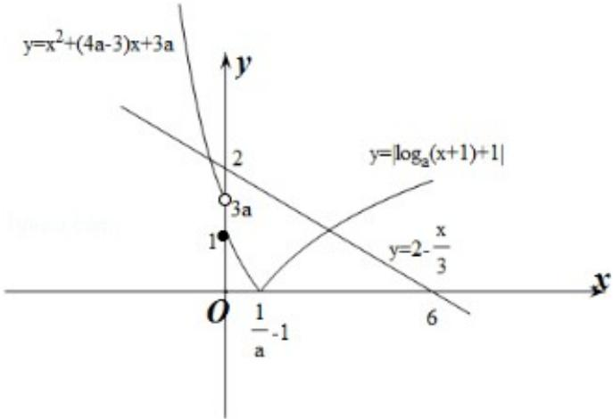

> [!faq]- 2016年天津高考文科数学试题及答案(Word版)解析
>
> > [!success]- **【答案】** 为 $\left[\frac{1}{3},\frac{2}{3}\right)$ ： 【点评】本题考查了分段函数的单调性, 函数零点的个数判断, 结合函数函数图象判断端点值的大小是关键, 属于中档题. ##
>
> > [!note]- **【分析】**
> > 由减函数可知 $f(x)$ 在两段上均为减函数，且在第一段的最小值大于或等于第二段上的最大值，作出 $|f(x)|$ 和 $y = 2 - \frac{x}{3}$ 的图象，根据交点个数判断3a与2的大小关系，列出不等式组解出.
>
> > [!note]- **【解析】**
> > 分析】由减函数可知 $f(x)$ 在两段上均为减函数，且在第一段的最小值大于或等于第二段上的最大值，作出 $|f(x)|$ 和 $y = 2 - \frac{x}{3}$ 的图象，根据交点个数判断3a与2的大小关系，列出不等式组解出.
> >
> > 【
> > 解答】解：∵f（x）是R上的单调递减函数，
> >
> > $\therefore y = x^{2} + (4a - 3)x + 3a$ 在 $(- \infty, 0)$ 上单调递减， $y = \log_a(x + 1) + 1$ 在 $(0, +\infty)$ 上单调递减，且 $f(x)$ 在 $(- \infty, 0)$ 上的最小值大于或等于 $f
> > (0)$ ： $\therefore \left\{ \begin{array}{l} \frac{3 - 4a}{2} \geqslant 0 \\ 0 < a < 1 \\ 3a \geqslant 1 \end{array} \right.$ ，解得 $\frac{1}{3} \leqslant a \leqslant \frac{3}{4}$ .
> >
> > 作出 $y = |f(x)|$ 和 $y = 2 - \frac{x}{3}$ 的函数草图如图所示：
> >
> > 
> >
> > $\because |f(x)| = 2 - \frac{x}{3}$ 恰有两个不相等的实数解，
> >
> > $\therefore 3a < 2$ ，即 $a < \frac{2}{3}$ .
> >
> > 综上， $\frac{1}{3}\leqslant a<\frac{2}{3}.$
> >
> > 故
> > 答案为 $\left[\frac{1}{3},\frac{2}{3}\right)$ ：
> >
> > 【点评】本题考查了分段函数的单调性, 函数零点的个数判断, 结合函数函数图象判断端点值的大小是关键, 属于中档题.
> >
> > ##
