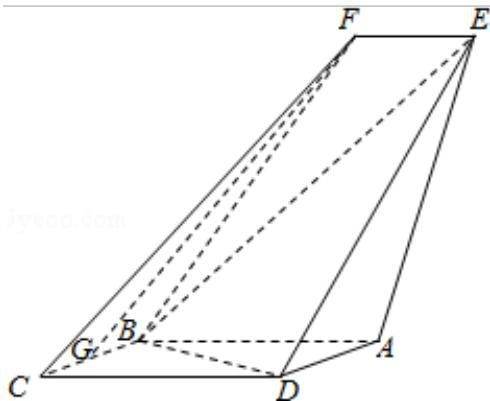

<!-- question-source:start -->
17. （13 分）（2016·天津）如图，四边形 ABCD 是平行四边形，平面 AED⊥平面 ABCD，EF∥AB，AB=2，DE=3，BC=EF=1，AE= $\sqrt{6}$ ， $\angle BAD=60^{\circ}$ ，G 为 BC 的中点.

(1) 求证: FG $\parallel$ 平面 BED;

(2) 求证: 平面 BED⊥平面 AED;

(3) 求直线 EF 与平面 BED 所成角的正弦值.

<!-- question-source:end -->

![[高中/真题/按年份分类/2016/2016年天津高考文科数学试题及答案_Word版_/解答题/题目/answers/Q00023737A1.md]]
