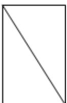
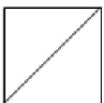
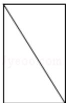
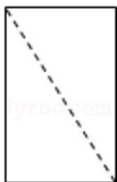
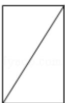
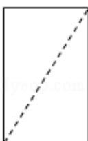

<!-- question-source:start -->
3.（5 分）(2016·天津) 将一个长方体沿相邻三个面的对角线截去一个棱锥, 得到的几何体的正视图与俯视图如图所示, 则该几何体的侧（左）视图为（）

  
正视图

  
俯视图

<!-- question-source:end -->

![[高中/真题/按年份分类/2016/2016年天津高考文科数学试题及答案_Word版_/选择题/题目/answers/Q00023723A1.md]]
