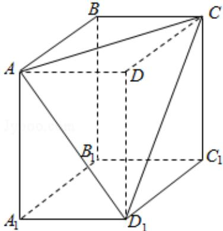

> [!faq]- 2016年天津高考文科数学试题及答案(Word版)解析
>
> > [!success]- **【答案】** . 【
>
> > [!note]- **【分析】**
> > 根据主视图和俯视图作出几何体的直观图，找出所切棱锥的位置，得出
>
> > [!note]- **【解析】**
> > 分析】根据主视图和俯视图作出几何体的直观图，找出所切棱锥的位置，得出
> > 答案.  
> > 【
> > 解答】解：由主视图和俯视图可知切去的棱锥为 $\mathrm{D - AD_1C}$
> >
> > 
> >
> > 棱 $\mathrm{CD}_{1}$ 在左侧面的投影为 $\mathrm{BA}_{1}$ ,
> >
> > 故选 B.
> >
> > 【点评】本题考查了棱锥，棱柱的结构特征，三视图，考查空间想象能力，属于基础题.
