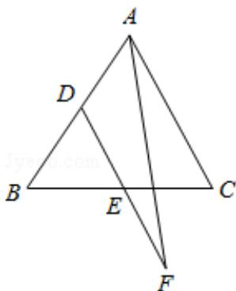

> [!faq]- 2016年天津高考文科数学试题及答案(Word版)解析
>
> > [!success]- **【答案】** B
>
> > [!note]- **【分析】**
> > 由题意画出图形, 把 $\overrightarrow{AF}$ 、 $\overrightarrow{BC}$ 都用 $\overrightarrow{BA}$ 、 $\overrightarrow{BC}$ 表示, 然后代入数量积公式得
>
> > [!note]- **【解析】**
> > 分析】由题意画出图形, 把 $\overrightarrow{AF}$ 、 $\overrightarrow{BC}$ 都用 $\overrightarrow{BA}$ 、 $\overrightarrow{BC}$ 表示, 然后代入数量积公式得
> > 答案.
> >
> > 【
> > 解答】解: 如图,
> >
> > 
> >
> > ∵D、E分别是边AB、BC的中点，且DE=2EF，
> >
> > $\therefore \overrightarrow{AF} \cdot \overrightarrow{BC} = (\overrightarrow{AD} + \overrightarrow{DF}) \cdot \overrightarrow{BC} = (-\frac{1}{2}\overrightarrow{BA} + \frac{3}{2}\overrightarrow{DE}) \cdot \overrightarrow{BC}$ $= (-\frac{1}{2}\overrightarrow{BA} + \frac{3}{4}\overrightarrow{AC}) \cdot \overrightarrow{BC} = (-\frac{1}{2}\overrightarrow{BA} + \frac{3}{4}\overrightarrow{BC} - \frac{3}{4}\overrightarrow{BA}) \cdot \overrightarrow{BC}$ $= (-\frac{5}{4}\overrightarrow{BA} + \frac{3}{4}\overrightarrow{BC}) \cdot \overrightarrow{BC} = -\frac{5}{4}\overrightarrow{BA} \cdot \overrightarrow{BC} + \frac{3}{4}\overrightarrow{BC}^2 = -\frac{5}{4} |\overrightarrow{BA}| \cdot |\overrightarrow{BC}| \cos 60^\circ + \frac{3}{4} \times 1^2$ $= -\frac{5}{4} \times 1 \times 1 \times \frac{1}{2} + \frac{3}{4} = \frac{1}{8}$ .
> >
> > 故选：B.
> >
> > 【点评】本题考查平面向量的数量积运算，考查向量加减法的三角形法则，是中档题.
