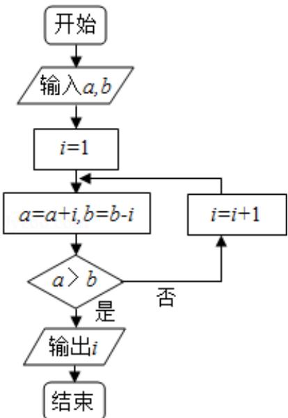

<!-- question-source:start -->
11. (5 分) (2016·山东) 执行如图的程序框图, 若输入的 a, b 的值分别为 0 和 9, 则输出的 i 的值为 \_\_\_\_.

<!-- question-source:end -->

![[高中/真题/按年份分类/2016/2016年山东省高考数学试卷_理科_word版试卷及解析/填空题/题目/answers/Q00023064A1.md]]
