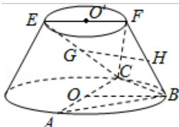

<!-- question-source:start -->
17.（12分）(2016·山东)在如图所示的圆台中，AC是下底面圆O的直径，EF是上底面圆 $O'$ 的直径，FB是圆台的一条母线.

(I) 已知 G，H 分别为 EC，FB 的中点，求证：GH∥平面 ABC；

（Ⅱ）已知 $\mathrm{EF} = \mathrm{FB} = \frac{1}{2}\mathrm{AC} = 2\sqrt{3}$ ， $\mathrm{AB} = \mathrm{BC}$ ，求二面角F-BC-A的余弦值.

<!-- question-source:end -->

![[高中/真题/按年份分类/2016/2016年山东省高考数学试卷_理科_word版试卷及解析/填空题/题目/answers/Q00023070A1.md]]
