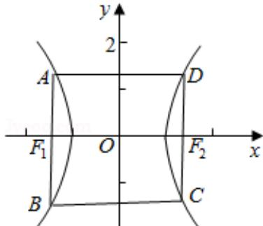

> [!faq]- 2016年山东省高考数学试卷(理科)word版试卷及解析解析
>
> > [!success]- **【答案】** 2
>
> > [!note]- **【分析】**
> > 可令 $x = c$ ，代入双曲线的方程，求得 $y = \pm \frac{b^2}{a}$ ，再由题意设出A，B，C，D的坐标，由2|AB|=3|BC|，可得a，b，c的方程，运用离心率公式计算即可得到所求值.
>
> > [!note]- **【解析】**
> > 解：令 $x = c$ ，代入双曲线的方程可得 $y = \pm b\sqrt{\frac{c^2}{a^2} - 1} = \pm \frac{b^2}{a}$
> >
> > 由题意可设 A（-c， $\frac{b^{2}}{a}$ ），B（-c， $-\frac{b^{2}}{a}$ ），C（c， $-\frac{b^{2}}{a}$ ），D（c， $\frac{b^{2}}{a}$ ），
> >
> > 由 $2|\mathrm{AB}| = 3|\mathrm{BC}|$ ，可得
> >
> > $2\cdot\frac{2b^{2}}{a}=3\cdot2c$ ，即为 $2b^{2}=3ac$ ，
> >
> > 由 $b^{2}=c^{2}-a^{2}$ ， $e=\frac{c}{a}$ ，可得 $2e^{2}-3e-2=0$ ，
> >
> > 解得 $\mathrm{e} = 2$ （负的舍去）.
> >
> > 故答案为：2.
> >
> > 
> >
> > 【点评】本题考查双曲线的离心率的求法，注意运用方程的思想，正确设出 A, B, C, D 的坐标是解题的关键，考查运算能力，属于中档题.
