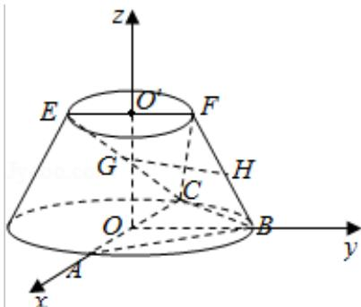

> [!faq]- 2016年山东省高考数学试卷(理科)word版试卷及解析解析
>
> > [!success]- **【答案】** 详见解析
>
> > [!note]- **【分析】**
> > （Ⅰ）取FC中点Q，连结GQ、QH，推导出平面GQH∥平面ABC，由此能证明GH∥平面ABC.
>
> > [!note]- **【解析】**
> > 分析】（Ⅰ）取FC中点Q，连结GQ、QH，推导出平面GQH∥平面ABC，由此能证明GH∥平面ABC.
> >
> > （Ⅱ）由 AB=BC，知 BO⊥AC，以 O 为原点，OA 为 x 轴，OB 为 y 轴，OO' 为 z 轴，建立空间直角坐标系，利用向量法能求出二面角 F-BC-A 的余弦值.
> >
> > 【
> > 解答】证明：（Ⅰ）取FC中点Q，连结GQ、QH，
> >
> > ∵G、H为EC、FB的中点，
> >
> > ∴GQ∥ $\frac{1}{2}$ EF, QH∥ $\frac{1}{2}$ BC,
> >
> > 又∵EF∥BO，∴GQ∥ $\frac{1}{2}$ BO,
> >
> > ∴平面 GQH∥平面 ABC，
> >
> > ∵GH⊂面 GQH，∴GH∥平面 ABC.
> >
> > 解：（Ⅱ）∵AB=BC，∴BO⊥AC，
> >
> > 又∵OO'⊥面ABC，
> >
> > ∴以 O 为原点，OA 为 x 轴，OB 为 y 轴，OO' 为 z 轴，建立空间直角坐标系，
> > 则 A（2√3，0，0），C（-2√3，0，0），B（0，2√3，0），O'（0，0，3），F（0，√3，3）， $\overrightarrow{FC} = (-2\sqrt{3}, -\sqrt{3}, -3)$ ， $\overrightarrow{CB} = (2\sqrt{3}, 2\sqrt{3}, 0)$ ，
> >
> > 由题意可知面ABC的法向量为 $\overrightarrow{00} = (0, 0, 3)$ ，设 $\vec{n} = (x_0, y_0, z_0)$ 为面FCB的法向量，
> >
> > 则 $\left\{ \begin{array}{l} \overrightarrow{\mathrm{n}} \cdot \overrightarrow{\mathrm{FC}} = 0 \\ \overrightarrow{\mathrm{n}} \cdot \overrightarrow{\mathrm{CB}} = 0 \end{array} \right.$ ，即 $\left\{ \begin{array}{l} -2\sqrt{3}\mathrm{x}_0 - \sqrt{3}\mathrm{y}_0 - 3\mathrm{z}_0 = 0 \\ 2\sqrt{3}\mathrm{x}_0 + 2\sqrt{3}\mathrm{y}_0 = 0 \end{array} \right.$ ，
> >
> > 取 $\mathrm{x_0 = 1}$ ，则 $\vec{\mathbf{n}} = (1, - 1, - \frac{\sqrt{3}}{3})$
> >
> > $$
> > \therefore \cos <   \overrightarrow {0 0 ^ {\prime}}, \vec {n} > = \frac {\overrightarrow {0 0 ^ {\prime}} \cdot \vec {n}}{| \overrightarrow {0 0 ^ {\prime}} | \cdot | \vec {n} |} = - \frac {\sqrt {7}}{7}.
> > $$
> >
> > ∵二面角 F - BC - A 的平面角是锐角，
> >
> > ∴二面角 F - BC - A 的余弦值为 $\frac{\sqrt{7}}{7}$ .
> >
> > 
> >
> > 【点评】本题考查线面平行的证明，考查二面角的余弦值的求法，是中档题，解题时要认真审题，注意向量法的合理运用.
