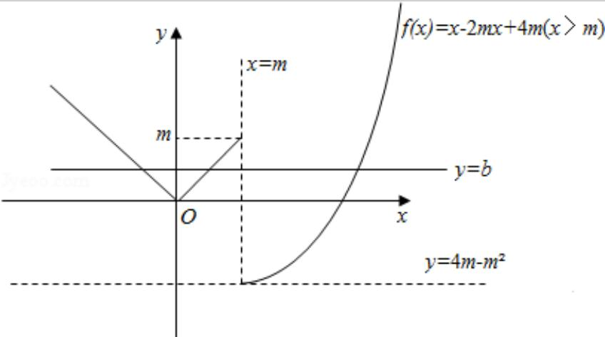

> [!faq]- 2016年山东省高考数学试卷(理科)word版试卷及解析解析
>
> > [!success]- **【答案】** 为： $(3, +\infty)$ .  【点评】本题考查根的存在性及根的个数判断，数形结合思想的运用是关键，
>
> > [!note]- **【分析】**
> > 作出函数 $f(x) = \begin{cases} |x|, & x \leqslant m \\ x^2 - 2mx + 4m, & x > m \end{cases}$ 的图象，依题意，可得 $4m - m^2 < m (m > 0)$ ，解之即可.
>
> > [!note]- **【解析】**
> > 分析】作出函数 $f(x) = \begin{cases} |x|, & x \leqslant m \\ x^2 - 2mx + 4m, & x > m \end{cases}$ 的图象，依题意，可得 $4m - m^2 < m (m > 0)$ ，解之即可.
> >
> > 【
> > 解答】解：当 $m > 0$ 时，函数 $f(x) = \left\{ \begin{array}{ll} |x|, & x \leqslant m \\ x^2 - 2mx + 4m, & x > m \end{array} \right.$ 的图象如下：
> >
> > $\because x > m$ 时， $f(x) = x^2 - 2mx + 4m = (x - m)^2 + 4m - m^2 > 4m - m^2,$
> >
> > ∴y 要使得关于 x 的方程 f (x) = b 有三个不同的根，
> >
> > 必须 $4m - m^{2} < m (m > 0)$ ，
> >
> > 即 $\mathrm{m}^2 > 3\mathrm{m}$ （ $\mathrm{m} > 0$ ），
> >
> > 解得 m>3，
> >
> > ∴m 的取值范围是 $(3, +\infty)$ ，
> >
> > 故
> > 答案为： $(3, +\infty)$ .
> >
> > 
> >
> > 【点评】本题考查根的存在性及根的个数判断，数形结合思想的运用是关键，
> > 分析得到 $4\mathrm{m} - \mathrm{m}^2 < \mathrm{m}$ 是难点，属于中档题.
> >
> > ## 三、解答题:：本大题共6小题，共75分.
