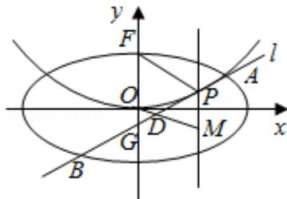

<!-- question-source:start -->
21. (14分) (2016·山东) 平面直角坐标系 xOy 中, 椭圆 C: $\frac{x^{2}}{a^{2}} + \frac{y^{2}}{b^{2}} = 1 (a > b > 0)$ 的离心率是 $\frac{\sqrt{3}}{2}$ , 抛物线 E: $x^{2} = 2y$ 的焦点 F 是 C 的一个顶点.

(I) 求椭圆 C 的方程;

（Ⅱ）设 P 是 E 上的动点，且位于第一象限，E 在点 P 处的切线 l 与 C 交与不同的两点 A，B，线段 AB 的中点为 D，直线 OD 与过 P 且垂直于 x 轴的直线交于点 M.

(i) 求证：点 M 在定直线上；

(ii) 直线 l 与 y 轴交于点 G，记 $\triangle PFG$ 的面积为 $S_{1}$ ， $\triangle PDM$ 的面积为 $S_{2}$ ，求 $\frac{S_{1}}{S_{2}}$ 的最大值及取得最大值时点 P 的坐标.

# 2016年山东省高考数学试卷（理科）

参考
<!-- question-source:end -->

![[高中/真题/按年份分类/2016/2016年山东省高考数学试卷_理科_word版试卷及解析/解答题/题目/answers/Q00023074A1.md]]
