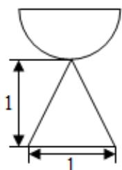
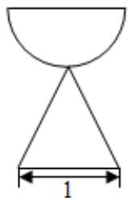
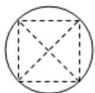

<!-- question-source:start -->
5. (5 分) (2016·山东) 一个由半球和四棱锥组成的几何体, 其三视图如图所示. 则该几何体的体积为 ( )

正（主）视图 侧（左）视图

  
俯视图

A. $\frac{1}{3} +\frac{2}{3}\pi$ B. $\frac{1}{3} +\frac{\sqrt{2}}{3}\pi$ C. $\frac{1}{3} +\frac{\sqrt{2}}{6}\pi$ D. $1 + \frac{\sqrt{2}}{6}\pi$
<!-- question-source:end -->

![[高中/真题/按年份分类/2016/2016年山东省高考数学试卷_理科_word版试卷及解析/选择题/题目/answers/Q00023058A1.md]]
