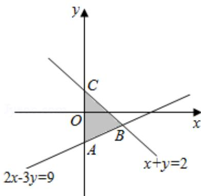

> [!faq]- 2016年山东省高考数学试卷(理科)word版试卷及解析解析
>
> > [!success]- **【答案】** C
>
> > [!note]- **【分析】**
> > 由约束条件作出可行域，然后结合 $x^{2}+y^{2}$ 的几何意义，即可行域内的动点与原点距离的平方求得 $x^{2}+y^{2}$ 的最大值.
>
> > [!note]- **【解析】**
> > 解：由约束条件 $\left\{\begin{aligned}&x+y\leqslant2\\ &2x-3y\leqslant9\\ &x\geqslant0\end{aligned}\right.$ 作出可行域如图，
> >
> > 
> >
> > $$
> > \therefore | \mathrm{OA} | > | \mathrm{OC} |,
> > $$
> >
> > 联立 $\left\{\begin{aligned}x+y=2\\ 2x-3y=9\end{aligned}\right.$ ，解得B（3，-1）.
> >
> > $$
> > \because | O B | ^ {2} = \left(\sqrt {3 ^ {2} + (- 1) ^ {2}}\right) ^ {2} = 1 0
> > $$
> >
> > $\therefore \mathrm{x}^{2} + \mathrm{y}^{2}$ 的最大值是10.
> >
> > 故选：C.
> >
> > 【点评】本题考查简单的线性规划，考查了数形结合的解题思想方法和数学转化思想方法，是中档题.
