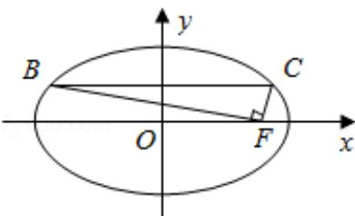

<!-- question-source:start -->
10. (5分) (2016·江苏) 如图, 在平面直角坐标系 xOy 中, F 是椭圆 $\frac{x^{2}}{a^{2}} + \frac{y^{2}}{b^{2}} = 1 (a > b > 0)$ 的右焦点, 直线 $y = \frac{b}{2}$ 与椭圆交于 B, C 两点, 且 $\angle BFC = 90^{\circ}$ , 则该椭圆的离心率是 \_\_\_\_.

<!-- question-source:end -->

![[高中/真题/按年份分类/2016/2016年江苏高考数学试题及答案/填空题/题目/answers/Q00024135A1.md]]
