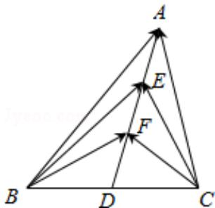

<!-- question-source:start -->
13.（5分）(2016·江苏)如图，在 $\triangle ABC$ 中，D是BC的中点，E，F是AD上的两个三等分点， $\overrightarrow{BA} \cdot \overrightarrow{CA} = 4$ ， $\overrightarrow{BF} \cdot \overrightarrow{CF} = -1$ ，则 $\overrightarrow{BE} \cdot \overrightarrow{CE}$ 的值是\_\_\_\_。

<!-- question-source:end -->

![[高中/真题/按年份分类/2016/2016年江苏高考数学试题及答案/填空题/题目/answers/Q00024138A1.md]]
