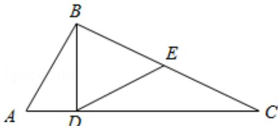

<!-- question-source:start -->
21. (10 分) (2016·江苏) 如图, 在 $\triangle ABC$ 中, $\angle ABC = 90^{\circ}$ , $BD \perp AC$ , $D$ 为垂足, $E$ 为 $BC$ 的中点, 求证: $\angle EDC = \angle ABD$ .

## B.【选修4—2：矩阵与变换】
<!-- question-source:end -->

![[高中/真题/按年份分类/2016/2016年江苏高考数学试题及答案/填空题/题目/answers/Q00024146A1.md]]
