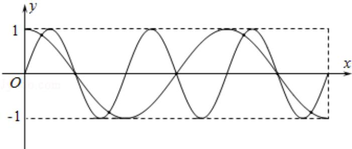

> [!faq]- 2016年江苏高考数学试题及答案解析
>
> > [!success]- **【答案】** . 【
>
> > [!note]- **【分析】**
> > 画出函数 $y=\sin2x$ 与 $y=\cos x$ 在区间 $[0,3\pi]$ 上的图象即可得到
>
> > [!note]- **【解析】**
> > 解：画出函数 $y = \sin 2x$ 与 $y = \cos x$ 在区间[0，3π]上的图象如下：
> >
> > 
> >
> > 由图可知，共7个交点.
> >
> > 故
