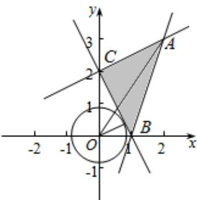

> [!faq]- 2016年江苏高考数学试题及答案解析
>
> > [!success]- **【答案】** $[\frac{4}{5}, 13]$
>
> > [!note]- **【分析】**
> > 作出不等式组对应的平面区域, 利用目标函数的几何意义, 结合两点间的距离公式以及点到直线的距离公式进行求解即可.
>
> > [!note]- **【解析】**
> > 解：作出不等式组对应的平面区域，
> >
> > 设 $z = x^{2} + y^{2}$ ，则 $\mathbf{z}$ 的几何意义是区域内的点到原点距离的平方，
> >
> > 由图象知 A 到原点的距离最大，
> >
> > 点 O 到直线 BC: $2x + y - 2 = 0$ 的距离最小，
> >
> > 由 $\left\{\begin{aligned}x-2y+4&=0\\ 3x-y&=0\end{aligned}\right.$ 得 $\left\{\begin{aligned}x&=2\\ y&=3\end{aligned}\right.$ ，即A（2，3），此时 $z=2^{2}+3^{2}=4+9=13$ ，
> >
> > 点O到直线BC： $2\mathrm{x} + \mathrm{y} - 2 = 0$ 的距离 $\mathrm{d} = \frac{| - 2|}{\sqrt{2^2 + 1^2}} = \frac{2}{\sqrt{5}}$
> >
> > 则 $z = d^2 = \left(\frac{2}{\sqrt{5}}\right)^2 = \frac{4}{5}$
> >
> > 故 $z$ 的取值范围是 $[\frac{4}{5}, 13]$ ,
> >
> > 故答案为： $[\frac{4}{5}, 13]$
> >
> > 
> >
> > 【点评】本题主要考查线性规划的应用，涉及距离的计算，利用数形结合是解决本题的关键.
