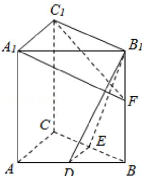

<!-- question-source:start -->
16. (14 分) (2016·江苏) 如图, 在直三棱柱 $ABC - A_1B_1C_1$ 中, D, E 分别为 AB, BC 的中点, 点 F 在侧棱 $B_1B$ 上, 且 $B_1D \perp A_1F$ , $A_1C_1 \perp A_1B_1$ . 求证:

(1) 直线 DE∥平面 $A_{1}C_{1}F$ ;

(2) 平面 $B_{1}DE \perp$ 平面 $A_{1}C_{1}F$ .

<!-- question-source:end -->

![[高中/真题/按年份分类/2016/2016年江苏高考数学试题及答案/解答题/题目/answers/Q00024141A1.md]]
