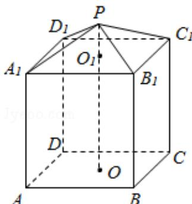

<!-- question-source:start -->
17.（14分）（2016·江苏）现需要设计一个仓库，它由上下两部分组成，上部的形状是正四棱锥 $\mathrm{P - A_1B_1C_1D_1}$ ，下部的形状是正四棱柱ABCD- $\mathrm{A}_1\mathrm{B}_1\mathrm{C}_1\mathrm{D}_1$ （如图所示），并要求正四棱柱的高 $\mathrm{O_1O}$ 是正四棱锥的高 $\mathrm{PO_1}$ 的4倍.

(1) 若 $\mathrm{AB} = 6 \mathrm{~m}$ , $\mathrm{PO}_{1} = 2 \mathrm{~m}$ , 则仓库的容积是多少?

(2) 若正四棱锥的侧棱长为 $6 \mathrm{~m}$ , 则当 $\mathrm{PO}_{1}$ 为多少时, 仓库的容积最大?

<!-- question-source:end -->

![[高中/真题/按年份分类/2016/2016年江苏高考数学试题及答案/解答题/题目/answers/Q00024142A1.md]]
