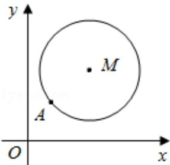

<!-- question-source:start -->
18. (16 分) (2016·江苏) 如图, 在平面直角坐标系 xOy 中, 已知以 M 为圆心的圆 M: $x^{2} + y^{2} - 12x - 14y + 60 = 0$ 及其上一点 A (2, 4).

(1) 设圆 N 与 x 轴相切，与圆 M 外切，且圆心 N 在直线 x=6 上，求圆 N 的标准方程；

(2) 设平行于 OA 的直线 l 与圆 M 相交于 B、C 两点，且 BC=OA，求直线 l 的方程；

(3) 设点 T(t, 0) 满足: 存在圆 M 上的两点 P 和 Q, 使得 $\overrightarrow{TA} + \overrightarrow{TP} = \overrightarrow{TQ}$ , 求实数 t 的取值范围.

<!-- question-source:end -->

![[高中/真题/按年份分类/2016/2016年江苏高考数学试题及答案/解答题/题目/answers/Q00024143A1.md]]
