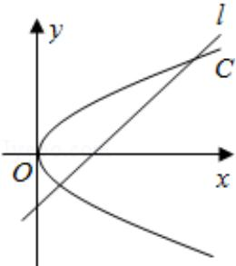

<!-- question-source:start -->
25. (10 分) (2016·江苏) 如图, 在平面直角坐标系 xOy 中, 已知直线 l: x - y - 2 = 0, 抛物线 C: $y^{2} = 2px$ (p > 0).

(1) 若直线 l 过抛物线 C 的焦点，求抛物线 C 的方程；

(2) 已知抛物线 C 上存在关于直线 l 对称的相异两点 P 和 Q.

① 求证：线段 PQ 的中点坐标为 $(2 - p, -p)$ ;

② 求 p 的取值范围.

<!-- question-source:end -->

![[高中/真题/按年份分类/2016/2016年江苏高考数学试题及答案/解答题/题目/answers/Q00024150A1.md]]
